<div align="center">
  
</div>

<div align="center">
  
  [](https://git.io/typing-svg)
  
</div>

<div align="center">
  
  
</div>

---

##  **About Me**


```javascript
const leVanHoa = {
    location: "Da Nang, Vietnam 🇻🇳",
    education: "Final Year Student 🎓",
    currentFocus: "Java Web Development",
    interests: [
        "Backend Development",
        "Fullstack Applications",
        "Clean Architecture",
        "System Design"
    ],
    currentlyLearning: ["Spring Boot", "ReactJS", "Microservices"],
    funFact: "Code is poetry written in logic 💡",
    motto: "Build today, innovate tomorrow 🚀"
};
```

<br clear="right"/>

---

##  **Technical Skills**

### 💻 Programming Languages
<p>
  
  
  
  
  
</p>

### 🚀 Frameworks & Libraries
<p>
  
  
  
  
  
</p>

### 🗄️ Databases
<p>
  
  
</p>

### 🛠️ Tools & Platforms
<p>
  
  
  
  
  
  
  
</p>

---

## 📊 **GitHub Analytics**

<div align="center">
  
  
</div>

<div align="center">
  
</div>

<div align="center">
  
</div>

---

## 🏆 **GitHub Trophies**

<div align="center">
  
</div>

---

## 📈 **Contribution Graph**

<div align="center">
  
</div>

---

## 🎯 **Current Focus**

```mermaid
graph LR
    A[🎓 Learning] --> B[Spring Boot]
    A --> C[ReactJS]
    A --> D[Microservices]
    B --> E[💼 Building Projects]
    C --> E
    D --> E
    E --> F[🚀 Career Growth]
    
    style A fill:#00D9FF,stroke:#0099CC,color:#000
    style E fill:#FF6D00,stroke:#CC5500,color:#fff
    style F fill:#6DB33F,stroke:#5A9C33,color:#fff
```



---

## 🌐 **Connect With Me**

<div align="center">
  
  [](mailto:your_email@gmail.com)
  [](https://www.linkedin.com/in/your-link/)
  [](https://github.com/yourusername)
  [](https://facebook.com/yourprofile)
  [](https://yourportfolio.com)
  
</div>

---

## 💭 **Random Dev Quote**

<div align="center">
  
  
  
</div>

---

## 🐍 **Contribution Snake**

<div align="center">
  
</div>

---

<div align="center">
  
  ### ⭐ ***"Code with passion, learn with curiosity, and build with purpose."*** ⭐
  
  
  
</div>
